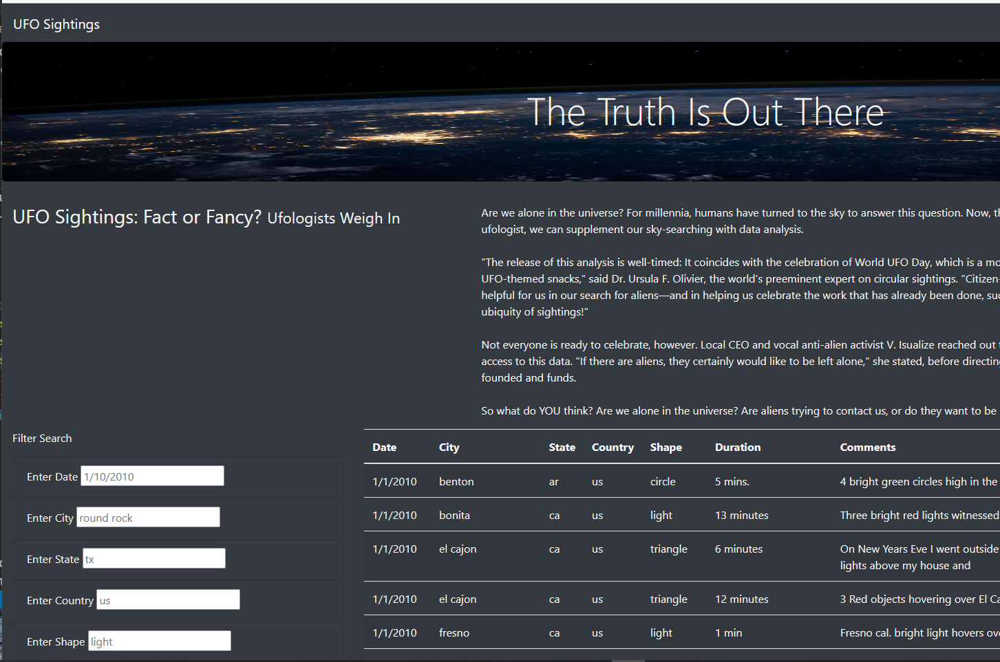
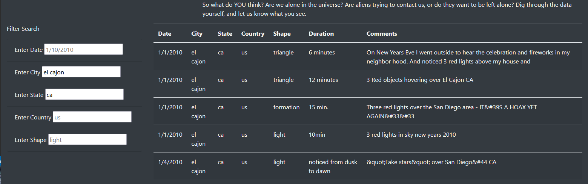

# UFOs

# Feasibility of providing an interactive web page for review of UFO sighting data
## Overview of Project
The purpose of this project was to provide an interactive web page for review of UFO sighting data as a proof of concept.
### Prior Work
An interactive website was prepared that allows users to view data in table format. The data was “read” from an array in a javascript file provided by others. This deliverable allowed users to filter the data by the date of the sighting.
### Current Work
An additional request was made to provide users the ability to filter data based on a variety of criteria beyond the date of the sighting, specifically to include filter options for city, state, country, and the shape of the object. 
## Results
The webpage now has five selection boxes, as shown below, instead of the previous single box. Users can enter filter selections as they wish (relevant to the topic). The click button has been removed and the “listener” refactored to respond to a change such as the press of the enter key or the click of the mouse anywhere on the page. Note that two letter abbreviations of the state and country must be used in those fields to match up with the provided data.

Any combination of selections can be made from five to none. Below is an image where the city “El Cajon” and the state of California is selected.

## Summary
A webpage providing a proof of concept was successfully implemented. 
### Potential Drawback of Current Implementation
-	It could be less clear to users how to cause the filters to “fire” without having a button.  However, it seems likely that most users will naturally hit the “enter” key or click their mouse or other pointer device.
-	Requiring two letter designations for state and country filters could be confusing for some users. Ideally, a mapping to full state and country names would be provided.
### Recommendations for Further Development
There are several possible follow ups to the current implementation. 
-	**More data:** A larger database spanning a longer historical period would be a natural extension.
-	**Full descriptions:** It may have been noticed that the descriptions were truncated. Ideally, full descriptions would be provided. As a practical matter, a truncated description would be initially displayed, and users could click the box to view the full description. 
-	**Live News Feed:** A live news feed could possibly be implemented, although it either would require an editor to periodically update the page or the automatic capture of the news feed from another web page that serves the purpose. 
